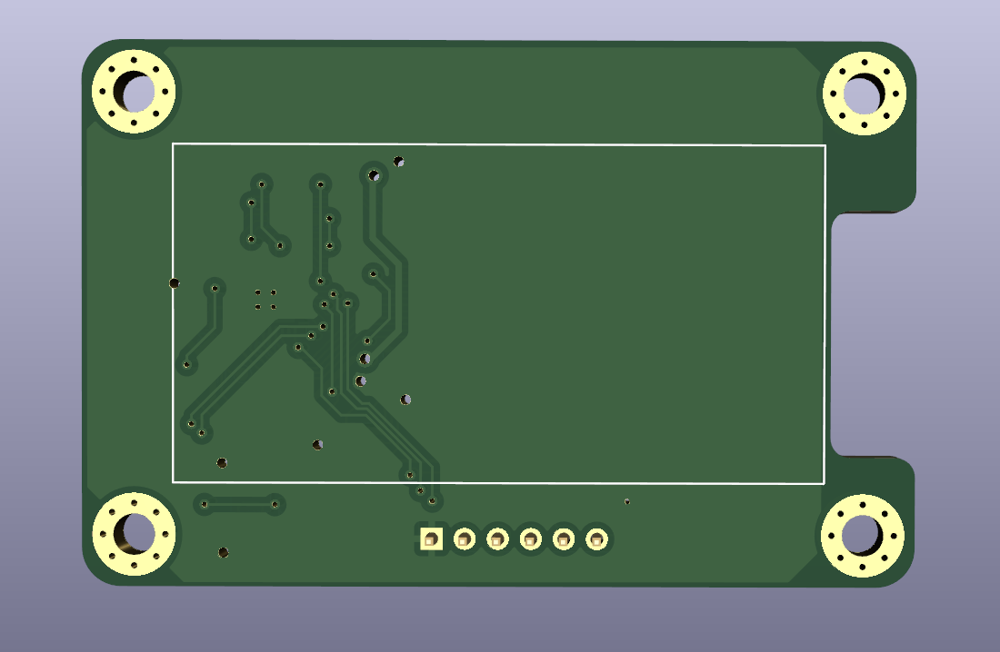
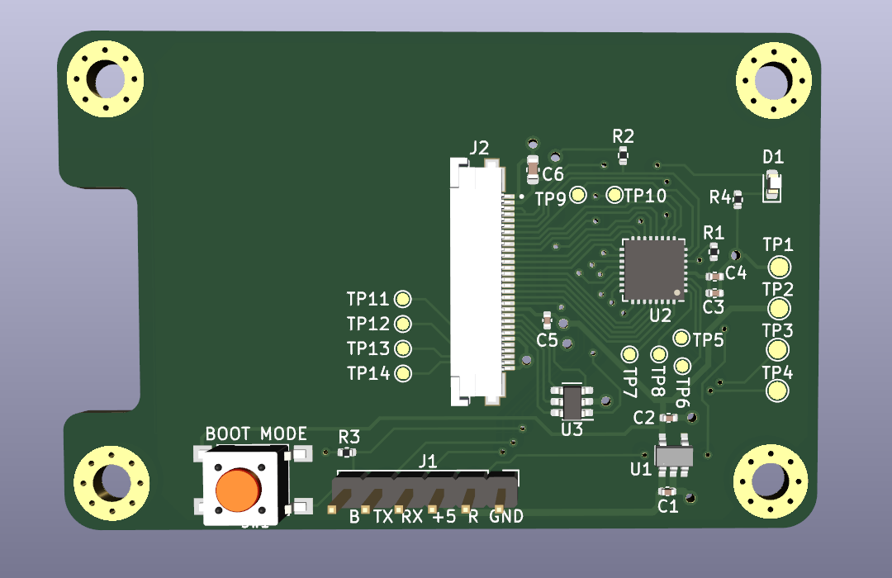

# bitaxe-OLED
bitaxe-OLED is a carrier board for a specific 1.9 inch 170x320 OLED
which is intended to connect to a bitaxe device via the BAP (Bitaxe Accessory Port)

Here is the OLED display

The display attaches to the front of the carrier board using double sided foam tape, and 
the connector wraps around through the notch and attaches to the 30-pin connector on the back.

This OLED display uses a ST7789 controller and can operate in parallel mode or SPI mode
through its 30-pin connector.  The carrier board uses an STM32 MCU to drive the OLED 
and the hardware is designed to support either parallel or SPI mode, depending on the 
needs of the firmware developer.

The pins used to support each interface are described in this table

The MCU firmware is flashed using the built-in STM32 serial bootloader which is activated 
by holding down the "boot" button while powering on the board.  A standard FTDI cable 
pinout was used to make firmware flashing easy but this pinout is not identical to the 
Bitaxe BAP, so a custom cable solution may be necessary to connect this to a bitaxe.

The MCU firmware will display various GUI pages, and the data for these pages will be 
supplied by the bitaxe through the UART.

The MCU is an STM32G0B1KEU6 which has 512KB of flash memory and 144K of RAM, and runs at 
64 MHz from the internal oscillator.
